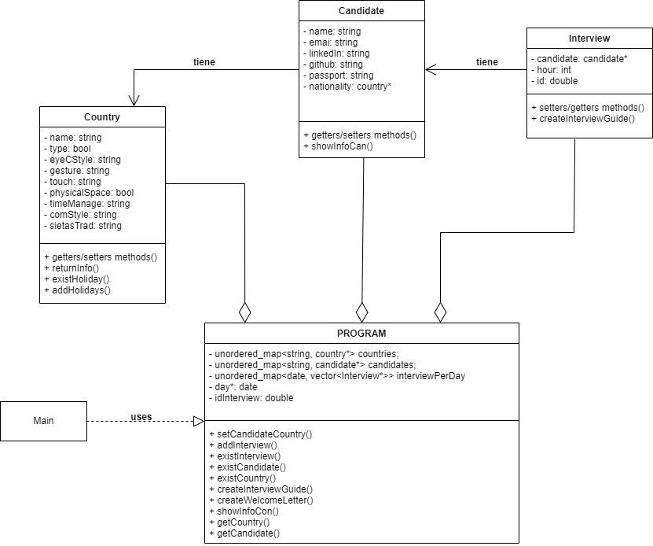
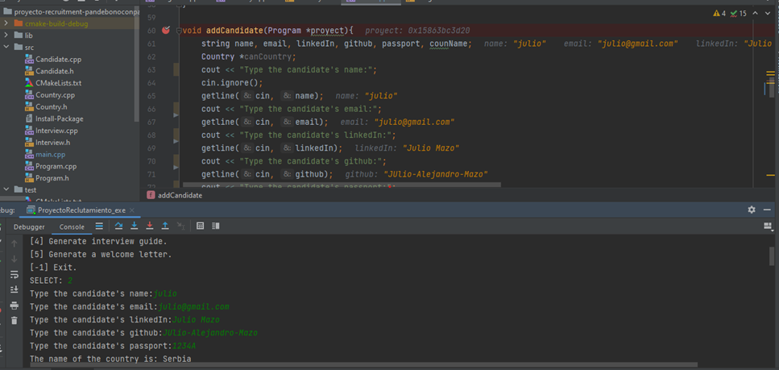
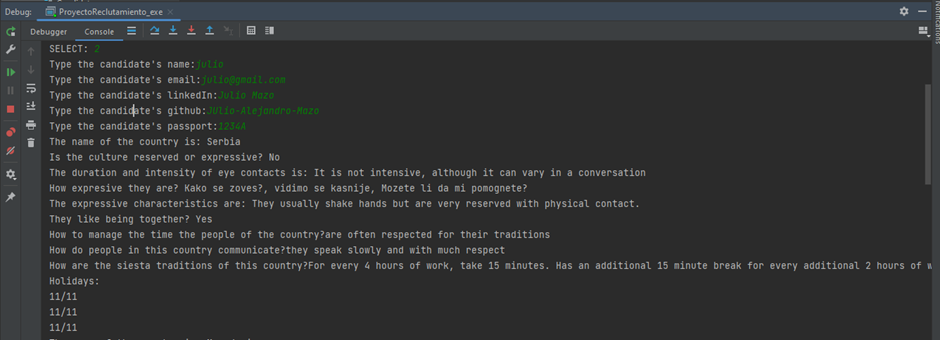
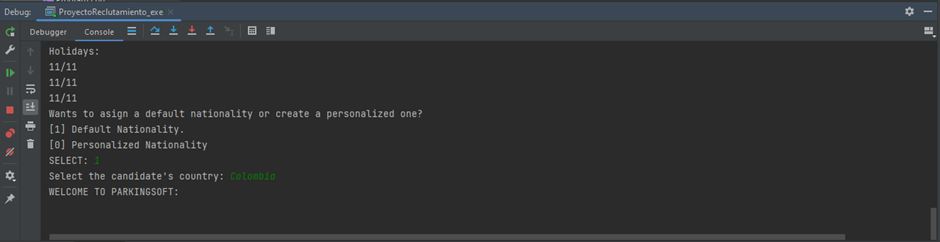
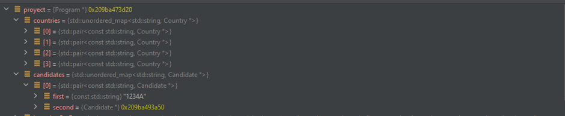
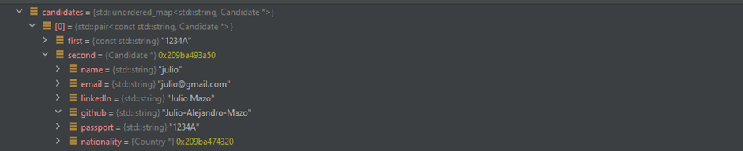
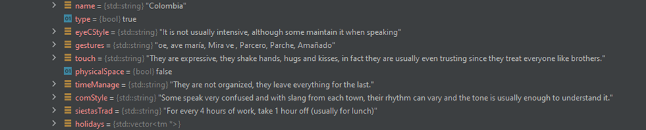
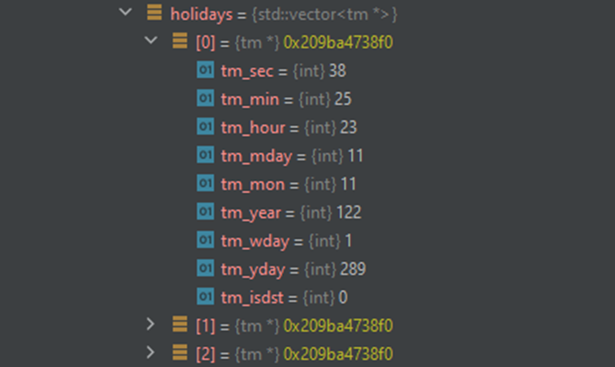

# Recruiter Software
Created by: Juan Esteban Becerra, Alejandro Sarmiento Rivera y Julio Mazo.

## Descripcion del Software
* ParkingSoft es una empresa colombiana que produce soluciones de software relacionadas con los servicios de aparcamiento. En los últimos años, esta empresa ha aumentado su cuota de mercado a segmentos de mercado en LATAM, Estados Unidos y Canadá
y desde junio de 2021 la empresa planea entrar en los mercados asiáticos.

* Este programa informático ayudaría a las personas de talento humano con información y apoyo para la contratación de personas de
  diferentes nacionalidades. El objetivo es proporcionar al personal una base de conocimientos para considerar mejor el factor cultural
  cultura a la hora de contratar e incorporar nuevos empleados.

## Uso del software
* Este software permite a los usuarios agregar información sobre los paises del mundo, en el que se muestra como es su cultura, su afecto
cultural, tiempos de trabajo, festivos, etc.

* Este software permite crear entrevistas de acuerdo la información de un candidato. Cada candidato tiene un nombre, una dirección de correo electrónico, una URL de LinkedIn, una URL de Github y un
  número de pasaporte. Además, según su nacionalidad, el candidato tendrá la
  información cultural correspondiente a partir de la información definida en el sistema.

* El sistema permite crear entrevistas, como maximo 3 por día desde las 10 AM a 12 M hora Bogotá. Una vez creada la entrevista
el software le permite al usuario crear una guía en el que contiene toda la información sobre el usuario a crear, y la hora y el día de la entevista.
El archivo lo genera como un txt con el nombre como pasaporte.

* El software puede crear una carta de bienvenida en la que se declara todos los terminos y condiciones de la empresa(aunque es en un modelo).

# NOTAS DE USO
* El software es de uso de consola y el sistema de guardado el de temporal, si se escribe algo no deseado en las entradas(inputs) el programa
crashea y se cierra.

* El sistema de fechas interno del programa tendrá problemas con el mes de febrero, ya que habrán veces que será bisiesto y, por ende, no funcionará correctamente.

* Este software es de uso universitario y tiene como propósito aprender sobre el lenguaje C++ y el paradigma de programación 
orientada a objetos.
## UML del software:

## Imagénes del Software Corriendo:

-

-

-

-

-

-
